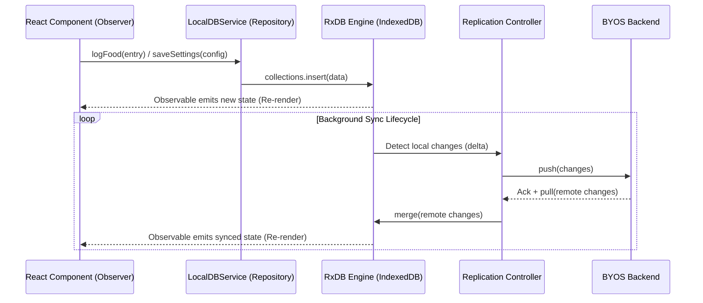

### 1. HIGH-LEVEL ARCHITECTURE

**System Context**
Quomida operates as a strictly local-first web application. The primary data store is an in-browser IndexedDB managed via RxDB. All user interactions (reads and writes) occur with zero latency against this local database. A decoupled Background Replication Service handles asynchronous synchronization with external Bring Your Own Storage (BYOS) providers, ensuring offline capability and eventual consistency without blocking the UI thread.

**Design Patterns**

* **Observer/Reactive Pattern:** UI components subscribe directly to RxDB RxJS Observables. Changes in the local database automatically trigger React re-renders.
* **Repository Pattern:** Data access services abstract the underlying RxDB implementation from the UI, enforcing a strict boundary for business logic.
* **Adapter Pattern:** The replication layer utilizes standardized interfaces to support multiple remote backends (e.g., `MockSyncAdapter.ts`, `GoogleDriveSheetsSyncAdapter.ts`) interchangeably.


* **Event Sourcing (Replication State Machine):** RxDB handles delta-syncs using `updatedAt` timestamps and internal tombstones to merge remote and local states seamlessly.

**Sequence Diagram**



---

### 2. DATA MODEL & PERSISTENCE

**Schema Changes (RxDB / JSON Schema)**
The database requires three strictly typed collections designed to support CRDT-like delta synchronization using `updatedAt` timestamps. RxDB automatically handles `_deleted` flags for tombstones.

* **`user_settings` Collection:**
```json
{
  "title": "user settings schema",
  "version": 0,
  "primaryKey": "id",
  "type": "object",
  "properties": {
    "id": { "type": "string", "maxLength": 100 },
    "dailyCalorieGoal": { "type": "number" },
    "macrosTarget": {
      "type": "object",
      "properties": {
        "protein": { "type": "number" },
        "carbs": { "type": "number" },
        "fat": { "type": "number" }
      }
    },
    "updatedAt": { "type": "number" }
  },
  "required": ["id", "dailyCalorieGoal", "updatedAt"]
}

```


* **`custom_foods` Collection:**
```json
{
  "title": "custom food schema",
  "version": 0,
  "primaryKey": "id",
  "type": "object",
  "properties": {
    "id": { "type": "string", "maxLength": 100 },
    "name": { "type": "string" },
    "brand": { "type": "string" },
    "baseAmount": { "type": "number" }, 
    "baseUnit": { "type": "string" },
    "calories": { "type": "number" },
    "macros": {
      "type": "object",
      "properties": {
        "protein": { "type": "number" },
        "carbs": { "type": "number" },
        "fat": { "type": "number" }
      }
    },
    "updatedAt": { "type": "number" }
  },
  "required": ["id", "name", "baseAmount", "baseUnit", "calories", "updatedAt"],
  "indexes": ["updatedAt"]
}

```


* **`food_logs` Collection:**
```json
{
  "title": "food tracking log schema",
  "version": 0,
  "primaryKey": "id",
  "type": "object",
  "properties": {
    "id": { "type": "string", "maxLength": 100 },
    "date": { "type": "string", "maxLength": 10 }, 
    "timestamp": { "type": "number" },
    "mealType": { "type": "string" },
    "foodId": { "type": "string" }, 
    "isCustom": { "type": "boolean" },
    "consumedAmount": { "type": "number" },
    "updatedAt": { "type": "number" }
  },
  "required": ["id", "date", "timestamp", "mealType", "foodId", "consumedAmount", "updatedAt"],
  "indexes": ["date", "updatedAt"]
}

```


**Relationships:**
`food_logs` documents reference items in either the static `seed_v1.json` catalog or the `custom_foods` collection. The `isCustom` flag directs the repository join logic.

**Caching Strategy:**
Client-side memory caching is handled inherently by RxDB's query results cache. No external caching layers are used.

---

### 3. API CONTRACTS (Interface Design)

As a local-first application, the "API" defines the internal TypeScript contracts exposing the database and synchronization controller to the UI.

**Database Initialization & Sync Configuration**

* **Method:** `initializeDatabase(config: AppConfig): Promise<RxDatabase>`
* **Request Payload:** `{ syncAdapter: 'google-sheets' | 'mock' | 'none', syncCredentials?: any }`
* **Behavior:** Spawns the local RxDB instance in `apps/webapp/src/db/rxdb.ts`. If a `syncAdapter` is provided, it instantiates the replication controller in the background utilizing adapters from `packages/sync-adapters/src`.


**Local Repository Interfaces**

* **Method:** `saveSettings(settings: UserSettings): Promise<void>`
* **Behavior:** Uses RxDB `upsert`. Updates the `updatedAt` timestamp to trigger delta replication.


* **Method:** `saveCustomFood(food: CustomFoodInput): Promise<string>`
* **Behavior:** Validates macro/calorie alignment, generates a UUID, applies `updatedAt`, and inserts into `custom_foods`.


* **Method:** `logFood(entry: FoodLogInput): Promise<void>`
* **Behavior:** Generates a UUID, applies `updatedAt`, and inserts into `food_logs`.


* **Method:** `observeLogsByDate(date: string): Observable<PopulatedFoodLog[]>`
* **Response:** Streams an array of logs, mapping `foodId` to food details from `seed_v1.json` or `custom_foods`.


---

### 4. ENGINEER TASK BREAKDOWN

**Backend / Core Data Layer**

* **Task [APP-101] [COMPLETED]: Initialize RxDB and IndexedDB Storage Adapter**
* **Description:** Set up the singleton RxDB instance in `apps/webapp/src/db/rxdb.ts` utilizing the Dexie/IndexedDB storage adapter.


* **Technical Definition of Done:** `initDB()` exports a valid RxDB instance. Unit tests write and read a dummy document using IndexedDB.
* **Dependencies:** None.


* **Task [APP-102] [COMPLETED]: Implement Sync-Ready Schema Definitions**
* **Description:** Translate JSON schemas for `user_settings`, `custom_foods`, and `food_logs` into TypeScript configurations within `apps/webapp/src/db/rxdb.ts`. Include `updatedAt` indexes.


* **Technical Definition of Done:** Database creation registers all three collections without schema validation errors.
* **Dependencies:** Blocked by [APP-101].


* **Task [APP-103] [COMPLETED]: Implement Replication Controller Boundary**
* **Description:** Create a configuration wrapper utilizing RxDB's `replicate()` function to integrate adapters from `packages/sync-adapters/src`.


* **Technical Definition of Done:** Database initializes with a `MockSyncAdapter.ts` that intercepts local writes and logs them, proving the UI thread is completely decoupled from the sync lifecycle.


* **Dependencies:** Blocked by [APP-102].


* **Task [APP-104] [COMPLETED]: Implement Local Database Repository Services**
* **Description:** Create abstraction classes for data mutations (`saveSettings`, `saveCustomFood`, `logFood`, `observeLogsByDate`). Ensure writes update `updatedAt`.
* **Technical Definition of Done:** Methods are fully typed. `observeLogsByDate` successfully joins data from `custom_foods` and `apps/webapp/src/assets/seed_v1.json`.


* **Dependencies:** Blocked by [APP-102].


**Frontend / UI Wiring**

* **Task [APP-105] [COMPLETED]: Wire SettingsModal to DB Service**
* **Description:** Connect `apps/webapp/src/components/SettingsModal.tsx` to the settings repository. Remove mock state.


* **Technical Definition of Done:** User saves calorie goals, refreshes the browser, and goals persist.
* **Dependencies:** Blocked by [APP-104].


* **Task [APP-106] [COMPLETED]: Wire CatalogManager for Custom Foods**
* **Description:** Connect `apps/webapp/src/components/CatalogManager.tsx` to persist custom foods to IndexedDB.


* **Technical Definition of Done:** Custom foods appear in search results alongside seed data. Validation blocks foods with mathematically impossible macros.
* **Dependencies:** Blocked by [APP-104].


* **Task [APP-107] [COMPLETED]: Wire FoodLogger and MacroRings Reactivity**
* **Description:** Update `apps/webapp/src/components/FoodLogger.tsx` and `apps/webapp/src/components/MacroRings.tsx` to subscribe to the `observeLogsByDate` stream.


* **Technical Definition of Done:** Adding a food updates macro rings instantly. Simulating a background remote sync (pushing data directly into RxDB) causes the UI to re-render automatically.
* **Dependencies:** Blocked by [APP-104], [APP-106].