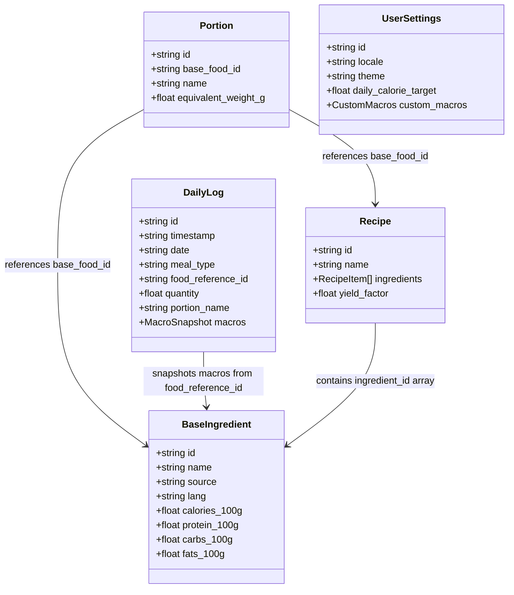
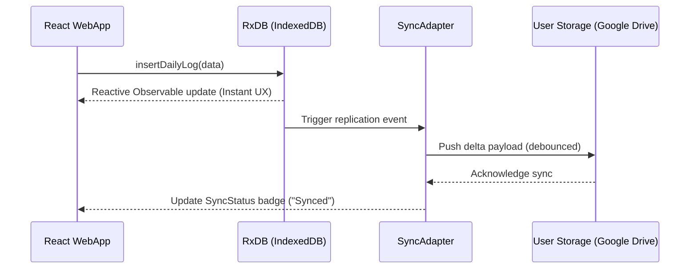

# 🏗️ Quomida System Architecture Blueprint

**Version:** 1.4  
**Architectural Style:** Monorepo, Local-First, Bring Your Own Storage (BYOS), Isomorphic TypeScript

---

## 1. System Overview

Quomida is a privacy-first, local-first web application designed for zero-latency calorie and macronutrient tracking. It eliminates client-side server dependency by storing all user state locally in **RxDB (IndexedDB)** and replicating changes asynchronously to the user's personal storage (Google Drive / Sheets).

```mermaid
graph TD
    subgraph Client Application (Browser / PWA)
        UI[React 19 WebApp] -->|Queries & Mutates| Repo[Domain Core Repository]
        Repo -->|RxDB API| DB[(Local RxDB Engine / IndexedDB)]
        DB -->|Native Observables| UI
    end

    subgraph BYOS Persistence Adapter
        DB -->|Delta Replication| SyncAdapter[SyncAdapter Interface]
        SyncAdapter -->|Mock / Test| MockSync[MockSyncAdapter]
        SyncAdapter -->|Production| GSheetsSync[GoogleDriveSheetsSyncAdapter]
    end

    subgraph User Personal Storage
        GSheetsSync -->|HTTPS / REST| Drive[(User Google Drive / Sheets)]
    end
```

---

## 2. Monorepo Package Architecture

Quomida operates as a clean monorepo structured to ensure complete isolation between domain logic, persistence adapters, and presentation:

```
quomida/
├── packages/
│   ├── domain-core/        # Isomorphic TS logic: RxDB JSON schemas, formulas, domain types
│   ├── sync-adapters/      # SyncAdapter interface, MockSyncAdapter, Google Drive adapter
│   ├── llm-engine/         # Natural language log parser with fallback handlers
│   └── i18n-locales/       # Centralized localization keys (es.json, en.json)
├── apps/
│   ├── webapp/             # React 19 + Vite + Tailwind PWA with glassmorphic mobile UI
│   ├── etl-pipeline/       # Node.js ETL pipeline normalizing LATINFOODS/ARGENFOODS/USDA datasets
│   └── cli/                # Terminal CLI for offline catalog inspection & domain testing
```

### Dependency Rules & Constraints
1. **`packages/domain-core`**: MUST remain strictly isomorphic. ZERO DOM dependencies, zero UI framework dependencies, and zero database driver imports.
2. **`packages/sync-adapters`**: Communicates strictly via `SyncDeltaPayload` objects.
3. **`apps/webapp`**: Consumes `@quomida/domain-core` and `@quomida/sync-adapters` via generic interfaces.

---

## 3. Data Model & RxDB Schemas

RxDB serves as the primary cache and single source of truth for the application.



### Collections Breakdown
- **`base_ingredients`**: Edible portion normalized to 100g base.
- **`recipes`**: Compound meals applying cooking yield retention factors (FAO/INFOODS standard).
- **`portions`**: Domestic household portion unit mappings (e.g. 1 slice, 1 portion = 150g).
- **`daily_logs`**: Transactional ledger of consumed items. Hardcodes macro snapshots at creation time for historical immutability.
- **`user_settings`**: Cross-device global preferences (`global_settings`).

---

## 4. BYOS Sync Flow Sequence



---

## 5. Design Patterns Applied

- **Adapter Pattern**: Swappable storage backends (Mock storage for offline dev/tests vs Google Drive Sheets for production).
- **Repository Pattern**: Wraps RxDB collections into typed domain methods.
- **Observer Pattern**: Native RxDB observables push live updates to React component state.
- **Isomorphic Domain Core**: Math calculations execute identically in Node.js (CLI/ETL) and Browser environments.
